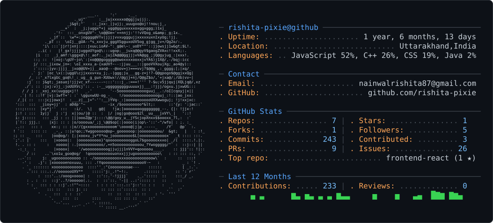

<picture>
  <source media="(prefers-color-scheme: dark)" srcset="dark_mode.svg" />
  <source media="(prefers-color-scheme: light)" srcset="light_mode.svg" />
  
</picture>

  
  
  

##  **About Me**

<table>
<tr>
<td width="60%">

👋 Hi! I'm **Rishita**, a passionate Computer Science student on a mission to blend creativity with technology.

  **education**  :  B.Tech CSE · Graphic Era Hill University · 3rd Year,
  
  **focus**      :  Full-Stack Web Dev, UI/UX Design, Systems & Kernel,
  
  **learning**   :  React, Node.js, Express.js,
  
  **goal**       :  Build impactful apps · Contribute to open-source · Ship real products,

> *"The best way to predict the future is to create it."* – Building mine, one commit at a time! 💪

</td>
<td width="40%">

  

</td>
</tr>
</table>

---

